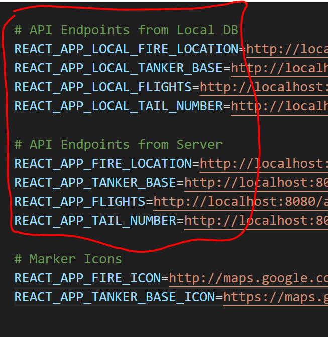

# NodeJS Setup

* Please install NodeJS version [`18.18.2`](https://nodejs.org/en/download) (`lts/hydrogen` should be fine too) 
    * Utilize [nvm installation guide](https://github.com/nvm-sh/nvm?tab=readme-ov-file#installing-and-updating)
    * Once nvm is ready, run `nvm install 18.18.2`
    * Then run `npm install -g npm@latest` for the latest npm (default is `v9.8.1` for `18.18.2`)

* Config File Setup
    * Create a file in the root of the `webapp` folder called `config.json` that follows the following format.

```json
{
    "host": "url_to_database",
    "database": "database_name",
    "user": "username_for_database",
    "password": "password_for_user"
}
```

* Client Environment Setup
    * In the `client/` folder, create a `.env` file that follows this format.
    * You will need to follow [this tutorial](https://developers.google.com/maps/documentation/javascript/get-api-key) from Google to get a Google Maps API Key.
        * Ensure to follow the `Before you Begin` section.
        * Then you can follow the `Create API Keys` section.
        * Finally, it is recommended to follow the `Restrict API Keys` section to secure your API key.
```
# API Key for Google Maps API
REACT_APP_GOOGLE_API_KEY=API_KEY

# API Endpoints from static server
REACT_APP_LOCAL_FIRE_LOCATION=http://localhost:8080/api/getLocalFireData
REACT_APP_FIRE_LOCATION=http://localhost:8080/api/getFireLocationData
REACT_APP_TANKER_BASE=http://localhost:8080/api/getTankerBaseData
REACT_APP_FLIGHTS=http://localhost:8080/api/getFlightData
REACT_APP_FLIGHT_INFO=http://localhost:8080/api/getFlightInfo

# Marker Icons
REACT_APP_FIRE_ICON=http://maps.google.com/mapfiles/ms/icons/caution.png
REACT_APP_TANKER_BASE_ICON=https://maps.gstatic.com/mapfiles/ms2/micons/rangerstation.png
```

# Local Database Usage
* If the SQLite version of the webapp is desired to be used, all that needs to be changed is the environment variable for the Local Database Endpoints.
    * **NOTE:** all of the `.db` files are included in the `server/` directory.
    * To use the local endpoints from the .env file, change the following:
        * `tankerBaseMarkers.jsx`: In the `Axios` get request, change the `process.env.REACT_APP_TANKER_BASE` to `process.env.REACT_APP_LOCAL_TANKER_BASE`
        * `flightMarkers.jsx`: 
            * In the **FIRST** `Axios` get request, change the `process.env.REACT_APP_FLIGHTS` to `process.env.REACT_APP_LOCAL_FLIGHTS`.
            * In the **SECOND** `Axios` get request, change the `process.env.REACT_APP_TAIL_NUMBER` to `process.env.REACT_APP_LOCAL_TAIL_NUMBER`
        * `fireMarkers.jsx`: In the `Axios` get request, change the `process.env.REACT_APP_FIRE_LOCATION` to `process.env.REACT_APP_LOCAL_FIRE_LOCATION`
    * Now, the webapp will work similarly with the local databases.
    * Refer below to the Endpoint Variables.
    
